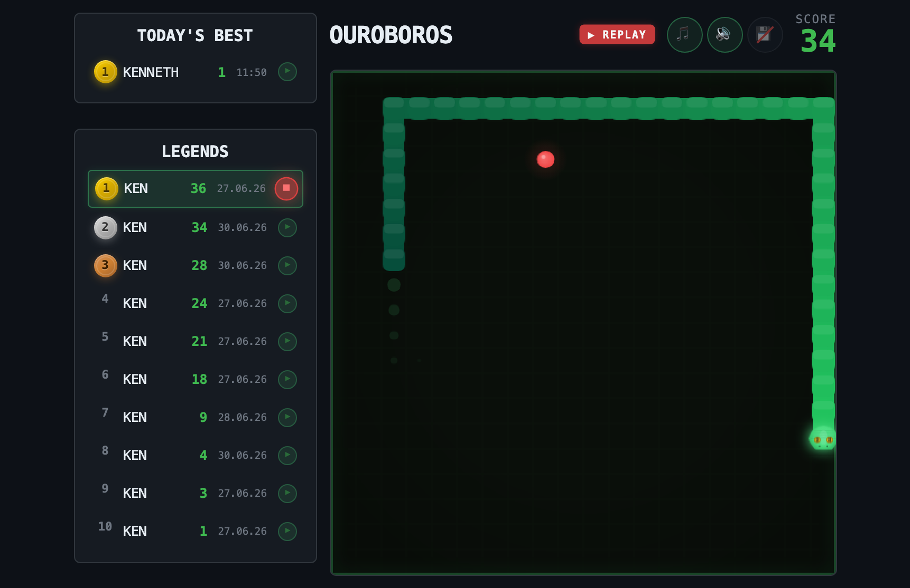

# Ouroboros

A snake that eats its own tail, and the first app Lucidos ever built.



## The story

In February 2026 I wanted my oldest son to be able to make a game by describing
it in a chat, and then play it immediately, in the same window, while we kept
changing it. That turned out to need a platform underneath, and that platform
became [Lucidos](https://github.com/lucidos-dev/lucidos).

The first thing it ever ran was a snake game. We iterated on it a lot: a Mario
sound when the snake eats an apple, a high score list of "legends", and some
music snippets that took A LOT of iteration to get right. It kept growing, and
it is now a plugin any Lucidos workspace can install.

## What you get

- **The game.** Arrow keys or WASD on desktop, swipe on mobile.
- **Legends.** An all-time top-10 board plus a separate list for today.
- **Replays.** Every scoring run is recorded. Hit the play button next to any
  entry on the leaderboard and watch that exact game play back.
- **Audio.** Fanfare when you place on the board, sad trombone when you do not.
  Both can be muted independently from the header.
- **Multiple players.** Switch player from the start screen; each one keeps
  their own name on the board.

Highscores are stored in your own workspace at
`artifacts/games/snake-highscores.json`. Nothing leaves your machine.

## Install

From a Lucidos workspace, just point the assistant at this URL:

```
Install https://github.com/lucidos-dev/plugins/tree/main/ouroboros
```

Or set the whole collection up as a marketplace once, and pick plugins from the
UI whenever you want one:

```
Set up https://github.com/lucidos-dev/plugins as a plugin marketplace
```

Then open the **Plugins** panel, uncheck "Installed only", and install Ouroboros
from the list.

Either way you get a confirmation panel before anything lands. No setup, no
credentials, no configuration: it works as soon as it is installed.

## Optional: a shared scoreboard

The game can sync one leaderboard across several people (family, friends, a
team) through a Lucidos proxy pointing at a Firebase Realtime Database. This is
entirely optional and off by default.

The point of routing it through a proxy is that the game itself never sees a
URL or a token. Those stay server-side in your workspace config, so installing
this plugin does not hand you somebody else's Firebase credentials, and sharing
your board does not hand yours to anyone else.

To set one up, ask your Lucidos assistant for a shared Ouroboros board. It will
read `apps/ouroboros/knowhow/storage-backends.md` (shipped with the plugin),
which documents the proxy entry, the database layout, and the security rules to
apply. Then open Ouroboros, click the save icon, and add the board by name.

## License

MIT, same as Lucidos.
